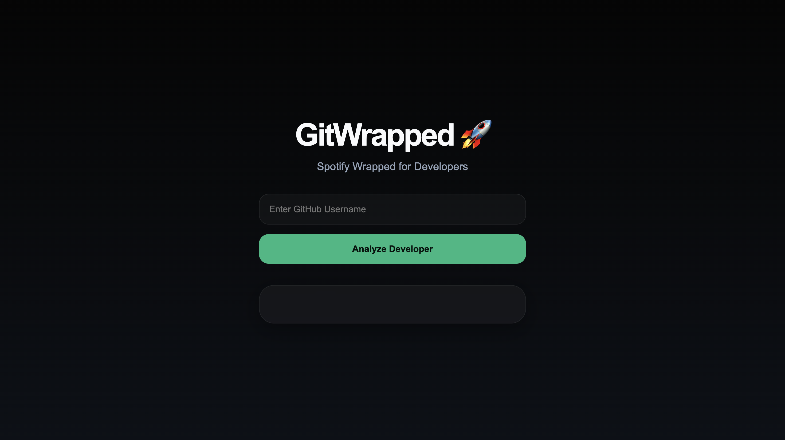
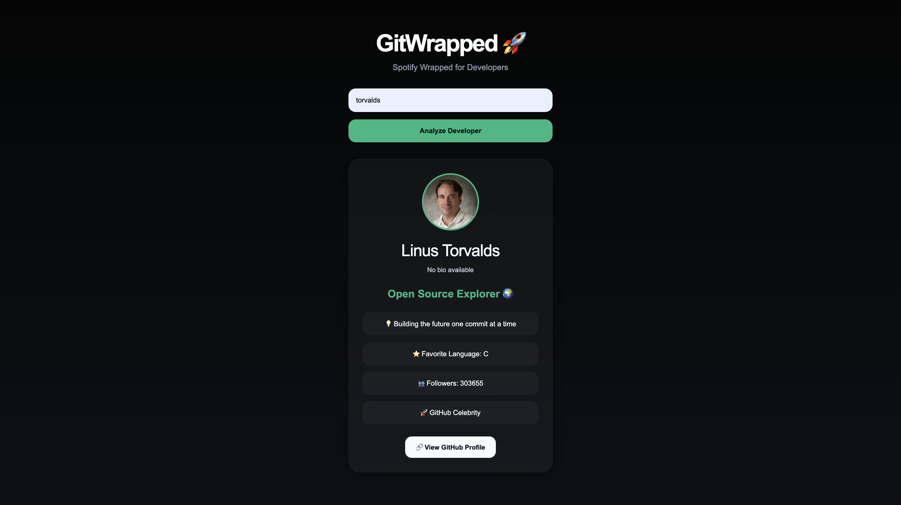

# GitWrapped

Spotify Wrapped for Developers.

GitWrapped analyzes any GitHub profile and generates developer insights like favorite programming language, coding personality, fame level, repository statistics, and language breakdown.

---

## Live Demo

### Frontend
https://git-wrapped-phi.vercel.app

### Backend API
https://gitwrapped.onrender.com

---

## Features

- GitHub profile analysis
- Developer personality detection
- Favorite programming language analysis
- Repository statistics
- Followers & following analytics
- Language breakdown
- Full-stack deployment

---

## Tech Stack

### Frontend
- HTML
- CSS
- JavaScript

### Backend
- Python
- FastAPI

### Deployment
- Vercel (Frontend)
- Render (Backend)

### API
- GitHub REST API

---

## Screenshots

### Landing Page



---

### Developer Analysis



---

## Example Analysis

Input:

```text
torvalds
```

Output:
- Favorite Language: C
- Developer Personality: Open Source Explorer
- Fame Level: GitHub Celebrity

---

## Project Structure

```text
GitWrapped/
│
├── frontend/
│   ├── index.html
│   ├── style.css
│   └── script.js
│
├── app/
│   ├── routers/
│   │   └── github.py
│   ├── services/
│   │   └── analyzer.py
│
├── main.py
├── requirements.txt
└── README.md
```

---

## Installation

Clone the repository:

```bash
git clone https://github.com/ShreyasPatil3105/GitWrapped.git
```

Go to project folder:

```bash
cd GitWrapped
```

Install dependencies:

```bash
pip install -r requirements.txt
```

Run backend:

```bash
uvicorn main:app --reload
```

Open frontend:

```text
frontend/index.html
```

---

## Future Improvements

- Contribution graph analysis
- AI-generated developer summaries
- GitHub streak tracking
- Charts and visual analytics
- Dark/Light theme toggle
- Mobile responsiveness improvements

---

## Author

Shreyas Patil

GitHub:
https://github.com/ShreyasPatil3105
